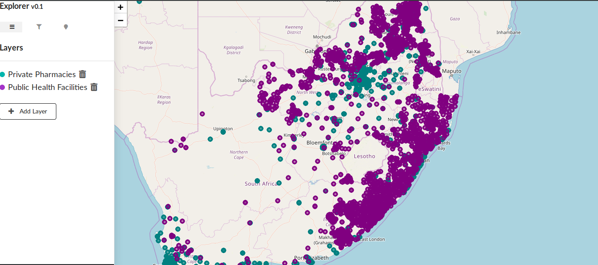
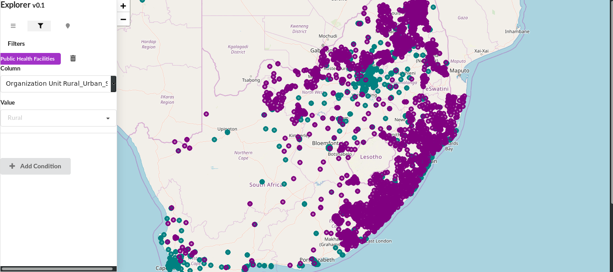
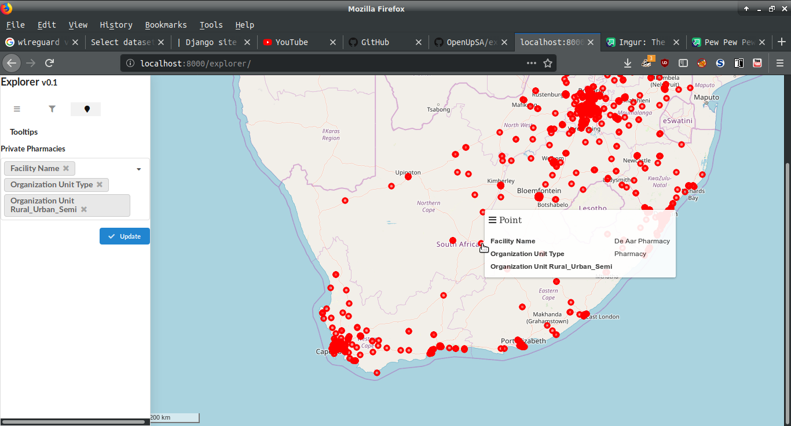

Explorer 0.3
=============

Explorer is a simple Django app to view points on the map.

Project is still under development, the first stable release will be 1.0


Install
--------------

1. ```pip install git+https://github.com/OpenUpSA/explorer.git@master#egg=explorer```


2. Add ```explorer``` to your INSTALLED_APPS
   
   ```
   INSTALLED_APPS = [
       ...
	   
       'explorer',
   ]
   ```
   
3. Include the explorer URLconf to the projects ```urls.py```

   ```
   url(r'^explorer/', include('explorer.urls', namespace='explorer'))
   ```
   
4. Configure the leaflet to centre your map, these settings are for South Africa

   ```
   LEAFLET_CONFIG = {
   
    'DEFAULT_CENTER': (-29.440, 29.443),
	
    'DEFAULT_ZOOM': 6,
	
    'MIN_ZOOM': 3,
	
    'MAX_ZOOM': 18,
	
    'RESET_VIEW': False
	}
   ```

5. Run ```python manage.py migrate``` to create the explorer models.

6. Make sure the admin app is enabled.


Layers
-------



Filters
---------


Tooltips
----------



